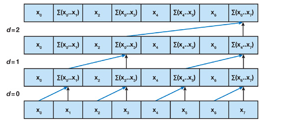
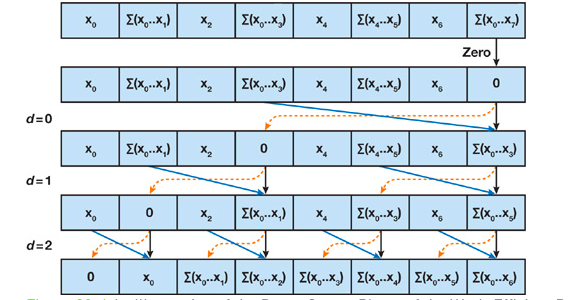
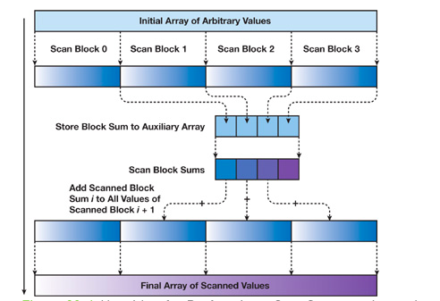

# prefix-scan
This is the implementation of prefix scan in serial and CUDA parallel

There are two folders in this project.

- part-I
- part-II

part-I implements the serial version of the prefix scan. part-II implements the GPU CUDA version of the prefix scan scan.

To run the program, please do the following steps.

- For the part-I

  Type the following commands while being in the prefix-scan directory!

  ```
  # cd part-I
  # mkdir build
  # cd build
  # cmake ..
  # make
  ```

- For the part-II

  Do the similar steps for creating executable in part-II
    Type the following commands while being in the prefix-scan directory!

     ```
  # cd part-II
  # mkdir build
  # cd build
  # cmake ..
  # make
  ```

The make command will generate `prefixScan` executable file in the build folder of the corresponding part. To run the executable type, please type on your command line following and it will run the test cases.
>`# ./prefixScan`


# Description

## Test Cases

Both of the parts create the test cases to test whether the algorithm works or not. It checks the output of the algorithm two times to make sure that the algorithm does prefix scan correctly.

 - The function `void exclusive_scan(std::vector<int>::iterator inStart,std::vector<int>::iterator inEnd, std::vector<int>::iterator outStart,int Start)` defined in file `/prefix-scan/part-I/src/utils.cpp` takes a input vector `inStart` of integers and write the prefix scan on the output vector `outStart`. This is implementation of `exclusive_scan` function defined in `<numeric>` library. However the library function is recentaly inlcuded in `gcc` , therefor it might not work on some machine which has a earlier version of `gcc`, so this function is implemented here additionaly.
 - The function `int sumExclusive(std::vector<int>::iterator inStart,std::vector<int>::iterator inEnd,int Start)`, defined in `/prefix-scan/part-I/src/utils.cpp` takes a input vector `inStart` of integers and return the last element of prefix scan. This function just add all the elements of input vector till the second to last element and return the sum, which should be the last element of the prefix scan.

For the algorithm to work correctly, it should take an array or vector of input integers and produce the output vector which is same as the output of `exclusive_scan` function, described above and the last element of the algorithm output should be equal to the return value of `sumExclusive` function, described above.

Both of the parts, run the algorithm for `100`cases and output whether the test is passed or failed and the time taken by the machine (in milliseconds) to do the computation. The part-II code also prints out the speed up achieved by using GPUs.

Every test case has a different size of random input integers. The size of the input array is also randomly generated. Out of 100 cases, the code has some cases where the size is taken as multiple of 2 as `2^i, where i = 1 to 25` to make sure that code tests cases which are a perfect size for GPU allowed memory.

## part-I
This is the sequential version of the prefix scan. The algorithm takes an array or vector of integers and does the prefix scan, according to the function in `Assignment::run()` which is defined in file `/prefix-scan/part-I/src/exclusiveScan.cpp` and then return the time taken  to do the computation.

A sample output of run look like this

```
# ls
README.md  part-I  part-II
# cd part-I
# ls
CMakeLists.txt	include  src  test
# mkdir build
# cd build
# ls
# cmake ..
-- The C compiler identification is GNU 7.4.0
-- The CXX compiler identification is GNU 7.4.0
-- Check for working C compiler: /usr/bin/cc
-- Check for working C compiler: /usr/bin/cc -- works
-- Detecting C compiler ABI info
-- Detecting C compiler ABI info - done
-- Detecting C compile features
-- Detecting C compile features - done
-- Check for working CXX compiler: /usr/bin/c++
-- Check for working CXX compiler: /usr/bin/c++ -- works
-- Detecting CXX compiler ABI info
-- Detecting CXX compiler ABI info - done
-- Detecting CXX compile features
-- Detecting CXX compile features - done
-- Configuring done
-- Generating done
-- Build files have been written to: /root/prefix-scan/part-I/build
# make
Scanning dependencies of target prefixScan
[ 25%] Building CXX object CMakeFiles/prefixScan.dir/test/testClass.cpp.o
[ 50%] Building CXX object CMakeFiles/prefixScan.dir/src/exclusiveScan.cpp.o
[ 75%] Building CXX object CMakeFiles/prefixScan.dir/src/utils.cpp.o
[100%] Linking CXX executable prefixScan
[100%] Built target prefixScan
# ls
CMakeCache.txt	CMakeFiles  Makefile  cmake_install.cmake  prefixScan
# ./prefixScan

==========================================================================================================
Elements	Host Test	Host Time(ms.)

2		PASS		0.004237
4		PASS		0.002246
8		PASS		0.002402
16		PASS		0.002996
32		PASS		0.004254
64		PASS		0.003980
128		PASS		0.008918
256		PASS		0.019849
512		PASS		0.026388
1024		PASS		0.051268
2048		PASS		0.081357
4096		PASS		0.028840
8192		PASS		0.085148
16384		PASS		0.108190
23488		PASS		0.179391
32768		PASS		0.259176
36909		PASS		0.291935
65536		PASS		0.518613
120795		PASS		0.956991
131072		PASS		1.034564
262144		PASS		1.954136
278501		PASS		2.173908
379165		PASS		2.970114
432852		PASS		3.212329
510027		PASS		3.932025
524288		PASS		4.072781
560359		PASS		4.269454
570425		PASS		4.299773
580491		PASS		4.442698
607335		PASS		4.706589
694576		PASS		5.270203
724775		PASS		5.665242
775107		PASS		5.845372
909325		PASS		6.906684
1048576		PASS		7.968288
1080452		PASS		8.217207
1107296		PASS		8.621255
1157627		PASS		8.899414
1181116		PASS		9.182034
1244869		PASS		9.749930
1251580		PASS		9.479717
1358954		PASS		10.695909
1385798		PASS		10.710095
1399219		PASS		10.693451
1496527		PASS		11.415584
1530082		PASS		12.020495
1637456		PASS		12.665841
1657588		PASS		13.137068
1664299		PASS		12.667160
1664299		PASS		12.903867
1707920		PASS		13.330395
1741475		PASS		13.422144
1754896		PASS		13.589951
1855560		PASS		14.238857
1855560		PASS		13.944049
1929379		PASS		14.794913
1969645		PASS		15.262650
1986422		PASS		15.231073
2060242		PASS		15.772344
2070308		PASS		15.861667
2073663		PASS		15.959503
2087085		PASS		16.084736
2090441		PASS		16.138052
2097152		PASS		16.031658
2137417		PASS		16.370193
2140772		PASS		19.344509
2144128		PASS		17.445223
2170971		PASS		17.371420
2207881		PASS		16.975992
2234725		PASS		17.237535
2251502		PASS		17.388577
2258213		PASS		17.467976
2268279		PASS		17.502943
2298478		PASS		21.381449
2328677		PASS		18.688768
2348810		PASS		19.755518
2399141		PASS		19.136499
2462895		PASS		19.781460
2519937		PASS		19.894760
2519937		PASS		19.419889
2523293		PASS		19.147299
2523293		PASS		19.220549
2536715		PASS		19.283539
2808505		PASS		21.499271
2899102		PASS		23.044361
2922591		PASS		22.615948
2996410		PASS		23.131809
3117206		PASS		23.822851
3147405		PASS		24.248308
3160827		PASS		24.282738
3170893		PASS		24.496513
3217870		PASS		24.945780
3278268		PASS		25.104334
3288334		PASS		25.211651
3298400		PASS		25.397724
3348732		PASS		26.588120
3355443		PASS		25.831257
4194304		PASS		32.342709
8388608		PASS		64.366196
16777216		PASS		131.058899
#
```

The code uses a random function to set up the test cases, the size of each test case and the integers for every test case, therefore when you run it on your machine, you might see a different output of run. However, the code should `PASS` every test case and print out the time taken by the machine.


## part-II

This part implements the GPU version of the prefix scan. The code uses the algorithm based on the one presented by Blelloch (1990). The algorithm works in two steps:

 - Reduction step: Where the sums are calculated on the binary tree level

    
    Source: https://developer.nvidia.com/gpugems/GPUGems3/gpugems3_ch39.html
 - Down-Sweep step: where the sums are saved on the binary tree level

     
     Source: https://developer.nvidia.com/gpugems/GPUGems3/gpugems3_ch39.html

The GPU code follows the following path:

  1. The code uses CUDA error code to catch the cuda error if there is any, by using the `_checkCudaError` function defined in`/prefix-scan/part-II/src/gpuScan.cu`.
  2. The input array on the cuda device is first stored in the shared memory of the cuda blocks and from that shared memory, the elements are processed. Therefore shared memory size is passed at the time of cuda kernel invocation.
  3. Every cuda thread process 2 elements, therefore elements per block are twice the size of threads per block. The maximum threads per block are defined as 512.
  4. In the function `void gpuData::exclusiveScan()` defined in file `/prefix-scan/part-II/src/gpuScan.cu`, the code, takes the input array and then initialize the memory on the GPU and then copy the input array on the GPU machine.
  5. Afterward, it checks whether the input size is bigger than the maximum elements per block.
  6. If the number of elements is not bigger than the maximum elements per block, then it calls a method `void gpuData::scanSmallerBlockSize()` which calls cuda kernel function` exclusiveScanGPU<<< >>>` with only one blocks and store the prefix scans in the output array. _Here important thing to remember the algorithm uses binary tree level approach, thus a variable has to be passed to the cuda kernel function which is equal to a number which would be next power of two from the size of the input array to be scanned. This is done to correctly compute the number of levels in the reduction step of the algorithm._
  7. If the number of elements is bigger than the maximum elements per block then it calls a method `void gpuData::scanLargerBlockSize()`. This function divides the input array into two parts.
        - First part is perfect multiple of elements per blocks and is processed by `void gpuData::scanPerfectBlockSize()` which calls cuda kernel function` exclusiveScanGPU<<< >>>` with more than one block and passes a temporary variable to collect the sums of different blocks. It stores the prefix scan of every block in the main output array and also stores the blocks' sums in the temporary temporary variable. Then it also scan those sums and add them in the main output array in the function `appendData<<<  >>>`.

        
        Source: https://developer.nvidia.com/gpugems/GPUGems3/gpugems3_ch39.html

        - The second part is the remainder of the input array and it runs a `void gpuData::scanSmallerBlockSize()` function on this remainder part.

        Then the code combines the output of these two parts so that the output array contains the correct result.

The code is self-explanatory and has comments, thus easy to follow.

The GPU performance can be optimized by handling the shared memory use bank conflicts. This youtube video (https://www.youtube.com/watch?v=CZgM3DEBplE) describes nicely what is shared memory bank conflicts. Therefore the GPU kernel function ` exclusiveScanGPU<<< >>>` avoid shared memory bank conflicts by using `BANKCONFLICTS_FREE_OFFSET(n,x) ((n) >> x)` function to shift the indexes of memory while loading them as well calling them. By default, it handles the bank conflict where there are total shared memory banks are 32, thus shift by 5 bytes.

- This is controlled by parameter `offBits` in the function ` gpuData::setData(int *in,int length)` in the file `prefix-scan/part-II/src/gpuScan.cu`  as `offBits = log2(SHARED_MEMORY_BANKS);` Set it to 0 if you don't want the offseting to be enabled. By default, it is enabled in the code.

The code can also be optimized at the step where the memory is loaded in the shared memory by not loading them consecutively, however by loading them halfwrap distances.
- This is controlled by parameter `halfWayLoad` in the function ` gpuData::setData(int *in,int length)` in the file `prefix-scan/part-II/src/gpuScan.cu`  as `halfWayLoad = 1;` Set it to 0 if you don't want the halfWayLoad to be enabled. By default it is anabled in the code.

A sample output of run look like this

```
# ls
README.md  part-I  part-II
# cd part-II
# ls
CMakeLists.txt	include  src  test
# mkdir build
# cd build
# ls
# cmake ..
-- The C compiler identification is GNU 7.4.0
-- The CXX compiler identification is GNU 7.4.0
-- Check for working C compiler: /usr/bin/cc
-- Check for working C compiler: /usr/bin/cc -- works
-- Detecting C compiler ABI info
-- Detecting C compiler ABI info - done
-- Detecting C compile features
-- Detecting C compile features - done
-- Check for working CXX compiler: /usr/bin/c++
-- Check for working CXX compiler: /usr/bin/c++ -- works
-- Detecting CXX compiler ABI info
-- Detecting CXX compiler ABI info - done
-- Detecting CXX compile features
-- Detecting CXX compile features - done
-- Looking for pthread.h
-- Looking for pthread.h - found
-- Looking for pthread_create
-- Looking for pthread_create - not found
-- Looking for pthread_create in pthreads
-- Looking for pthread_create in pthreads - not found
-- Looking for pthread_create in pthread
-- Looking for pthread_create in pthread - found
-- Found Threads: TRUE
-- Configuring done
-- Generating done
-- Build files have been written to: /root/prefix-scan/part-II/build
# make
[ 16%] Building NVCC (Device) object CMakeFiles/prefixScan.dir/src/prefixScan_generated_gpuScan.cu.o
[ 33%] Building NVCC (Device) object CMakeFiles/prefixScan.dir/src/prefixScan_generated_cudaKernels.cu.o
Scanning dependencies of target prefixScan
[ 50%] Building CXX object CMakeFiles/prefixScan.dir/test/testClass.cpp.o
[ 66%] Building CXX object CMakeFiles/prefixScan.dir/src/exclusiveScan.cpp.o
[ 83%] Building CXX object CMakeFiles/prefixScan.dir/src/utils.cpp.o
[100%] Linking CXX executable prefixScan
[100%] Built target prefixScan
# ls
CMakeCache.txt	CMakeFiles  Makefile  cmake_install.cmake  prefixScan
# ./prefixScan

==========================================================================================================
Elements	Host Test	Host Time(ms.)		GPU Test	GPU Time(ms)		Speed Up

2		PASS		0.003315		PASS		0.011232		0.295139
4		PASS		0.000996		PASS		0.013184		0.075546
8		PASS		0.000939		PASS		0.011232		0.083600
16		PASS		0.001069		PASS		0.010240		0.104395
32		PASS		0.001196		PASS		0.012288		0.097331
64		PASS		0.001528		PASS		0.013312		0.114784
128		PASS		0.002001		PASS		0.013312		0.150316
256		PASS		0.002900		PASS		0.026624		0.108924
512		PASS		0.004871		PASS		0.014240		0.342065
1024		PASS		0.009431		PASS		0.015328		0.615279
2048		PASS		0.015159		PASS		0.316416		0.047908
3355		PASS		0.024356		PASS		0.282624		0.086178
4096		PASS		0.029305		PASS		0.287744		0.101844
8192		PASS		0.057573		PASS		0.286720		0.200799
16384		PASS		0.116025		PASS		0.295936		0.392061
32768		PASS		0.232768		PASS		0.263968		0.881804
43620		PASS		0.288772		PASS		0.247360		1.167416
50331		PASS		0.349803		PASS		0.287328		1.217434
65536		PASS		0.457230		PASS		0.230912		1.980105
97307		PASS		0.674008		PASS		0.205888		3.273663
110729		PASS		0.783248		PASS		0.191616		4.087592
131072		PASS		0.909304		PASS		0.166336		5.466670
208037		PASS		1.447054		PASS		8.006144		0.180743
218103		PASS		1.508750		PASS		0.188480		8.004827
262144		PASS		1.754553		PASS		0.187136		9.375817
265080		PASS		1.839956		PASS		0.193568		9.505476
308700		PASS		2.132106		PASS		0.204640		10.418814
402653		PASS		2.762089		PASS		0.212224		13.014970
473117		PASS		3.196893		PASS		0.235872		13.553508
506671		PASS		3.498994		PASS		0.226048		15.478988
524288		PASS		3.555721		PASS		0.217664		16.335825
583847		PASS		4.139097		PASS		0.245952		16.828882
704643		PASS		4.800388		PASS		0.278752		17.220999
734842		PASS		4.945799		PASS		0.261504		18.912899
855638		PASS		6.451773		PASS		0.592800		10.883557
956301		PASS		7.413169		PASS		1.012224		7.323645
983144		PASS		6.654533		PASS		0.296704		22.428188
993211		PASS		6.832359		PASS		0.479328		14.254036
1020054		PASS		7.601546		PASS		0.301024		25.252293
1036831		PASS		8.031374		PASS		0.328384		24.457262
1048576		PASS		7.980935		PASS		0.305952		26.085579
1067030		PASS		8.275723		PASS		0.521088		15.881623
1117362		PASS		8.761304		PASS		1.385920		6.321652
1124073		PASS		9.168228		PASS		6.636224		1.381543
1254935		PASS		9.702978		PASS		0.485920		19.968262
1258291		PASS		9.667048		PASS		0.514912		18.774176
1268357		PASS		8.563443		PASS		0.488032		17.546888
1322044		PASS		10.162740		PASS		3.189504		3.186307
1342177		PASS		10.235331		PASS		4.536896		2.256021
1563636		PASS		11.057676		PASS		0.498688		22.173536
1563636		PASS		10.455359		PASS		1.105696		9.455908
1597190		PASS		12.060006		PASS		0.504256		23.916435
1630745		PASS		11.263750		PASS		0.529184		21.285130
1664299		PASS		13.495428		PASS		0.519872		25.959135
1667655		PASS		12.722130		PASS		0.509440		24.972773
1684432		PASS		12.842264		PASS		0.539840		23.789021
1791806		PASS		13.802063		PASS		0.528800		26.100723
1845493		PASS		15.597629		PASS		0.530528		29.400198
1868981		PASS		14.188718		PASS		7.447360		1.905201
1885759		PASS		12.886957		PASS		0.537600		23.971275
1899180		PASS		12.774820		PASS		6.665216		1.916640
1966289		PASS		15.190165		PASS		0.579712		26.202951
1969645		PASS		15.308417		PASS		0.551744		27.745508
1983066		PASS		16.670691		PASS		0.550304		30.293602
1999844		PASS		15.491077		PASS		0.560128		27.656319
2003199		PASS		16.014334		PASS		0.577952		27.708759
2026687		PASS		16.182249		PASS		3.533760		4.579329
2040109		PASS		15.373107		PASS		0.553728		27.762922
2043464		PASS		15.680973		PASS		0.591840		26.495289
2097152		PASS		16.450445		PASS		5.104544		3.222706
2164260		PASS		16.404388		PASS		1.020192		16.079706
2251502		PASS		15.399819		PASS		0.585280		26.311884
2305189		PASS		16.041641		PASS		0.634432		25.285044
2311900		PASS		18.334654		PASS		2.305376		7.952999
2321966		PASS		17.960316		PASS		0.596064		30.131523
2325322		PASS		17.739105		PASS		0.593984		29.864618
2392431		PASS		18.156521		PASS		0.622368		29.173288
2459539		PASS		19.508303		PASS		0.611360		31.909681
2530004		PASS		19.401917		PASS		0.634240		30.590813
2573624		PASS		22.042534		PASS		0.625344		35.248653
2654155		PASS		21.001223		PASS		0.640384		32.794731
2691065		PASS		21.089123		PASS		1.444736		14.597216
2714553		PASS		20.747723		PASS		0.652384		31.802931
2785017		PASS		21.751486		PASS		0.659744		32.969585
2845415		PASS		24.086170		PASS		0.672320		35.825455
2932657		PASS		22.455564		PASS		0.724160		31.009119
2999766		PASS		22.910112		PASS		0.689504		33.226944
3050097		PASS		23.324808		PASS		0.692640		33.675224
3056808		PASS		23.253510		PASS		2.880544		8.072611
3113851		PASS		24.923824		PASS		0.702304		35.488655
3150761		PASS		24.354069		PASS		0.716576		33.986721
3154116		PASS		26.189089		PASS		1.177408		22.243002
3207803		PASS		25.035007		PASS		0.733344		34.138149
3241358		PASS		24.904587		PASS		0.715904		34.787605
3271557		PASS		24.971210		PASS		0.721952		34.588463
3342021		PASS		26.745758		PASS		3.888704		6.877808
3348732		PASS		25.800465		PASS		0.736768		35.018436
4194304		PASS		32.896790		PASS		9.358368		3.515227
8388608		PASS		65.974716		PASS		1.402848		47.029125
16777216		PASS		129.513351		PASS		2.477504		52.275738
```

The code uses a random function to setup the test cases, the size of each test case and the integers for every test case, therefore when you run it on your machine, you might see a different output of run. However, the code should `PASS` every test case, for both host and cuda device and print out the time taken by machines and speed ups.

If you increase the number of input array which is larger than the allowed memory on your GPU, then you might run in the problem. A possible solution is to use multi GPUs, however, then you have to make changes for communication between GPUs.
